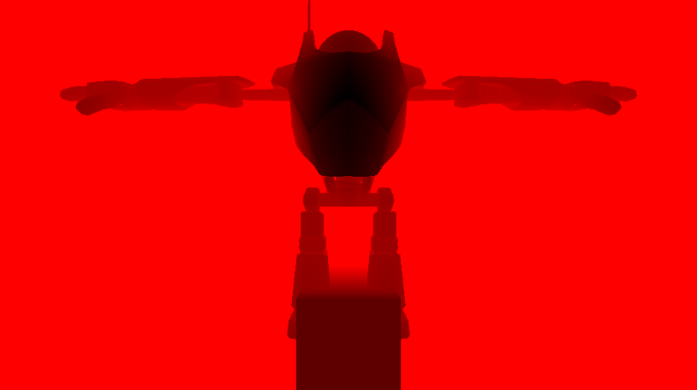
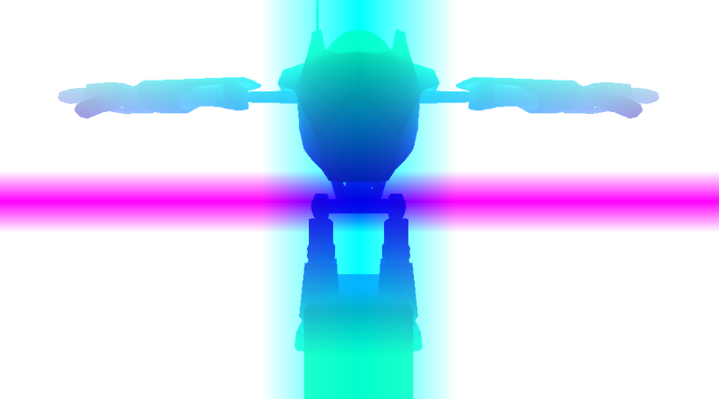
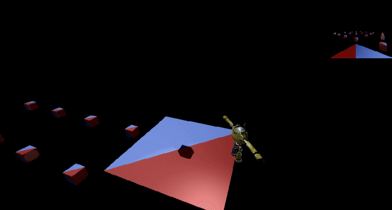

# My First Rendering Engine

## Overview
Project made for a course of 3D-programming using DirectX 11. Various features developed by me over a 6 month period in 2022. Developed in c++, it is most easily opened and compiled with visual studio.

Use **wasd** for movement and arrows for pivoting the camera.

## Features
The course assignment required various features to be implemented. Each feature is explained and presented below.

### Custom OBJ Importer
A simple parser for loading OBJ models together with their MTL files to specify material properties. Quite bare bones but worked well enough for the assignment.

### Phong Lighting
A basic PHONG lighting system supporting models utilizing albedo, specular and normal maps.

### Shadow Maps
Realtime dynamic lights with shadowmaps. Supports shadowmaps for directional-, spot- and point-lights. Point lights utilize a cubmap for shadowmapping.

### Deferred Rendering
A basic Deferred rendering setup is used, with the vertex and pixel shaders generating G-buffers and a compute shader constructs the final rendered image using them. Positions were reconstructed from the z depth to minimize the needed G-buffer data.

**Depth buffer**

**Reconstructed positions**

### Quad-Tree Culling
Objects can be ordered into a quad-tree structure that is used for frustrum culling. The viewing frustrum checks for intersection with the different levels of the quad tree to figure out which objects are in view, and which ones can be excluded from rendering.

The below scene shows an overhead view of the rendered scene when a camera rotates in the center. The view of the camera is showcased in the upper right corner.

### Tessellation
Simple tessellation was implemented in the project using Hull and Domain shaders to make an example of a distance based LOD system. However, the implementation seem to be currently broken or I've just forgotten how to activate the feature. Why there is no demonstration here.

### Mirror Reflections
Dynamic mirror reflections were implemented utilizing a cubemap that was rendered of the entire scene. This feature it seems I've also forgotten how to demonstrate or it has broken sadly.

### Particle System
A simple particle system was implemented using Compute shaders. The system utilized two buffers for storing the particle states. These buffers would take turns being append and consume buffers. The Compute dispatch updating the particles would take the current consume buffer and update every particle and move them into the append buffer. Before the next update, the buffers are switched and moved back again in the update. 

This setup made it very simple to remove and add particles if the original buffer sizes could fit them. However, the order of particles in the buffer cannot be guaranteed.

The particles are rendered as screen-space planes using the Geometry shader to turn a particle point into two triangles forming a plane. A plane that can be given a texture with transparency.

## Issues
It can only seem to run in debug mode. Don't remember if that was an issue when I made the project originally. 

Models using Tessellation or Reflection seem to be broken. Know for a fact they did work when I first made the project. Possibly I have just forgotten how to enable it properly, revisiting old code can prove to be quite the enigma.

